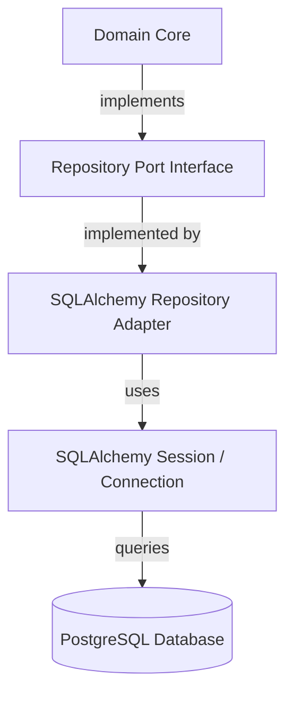
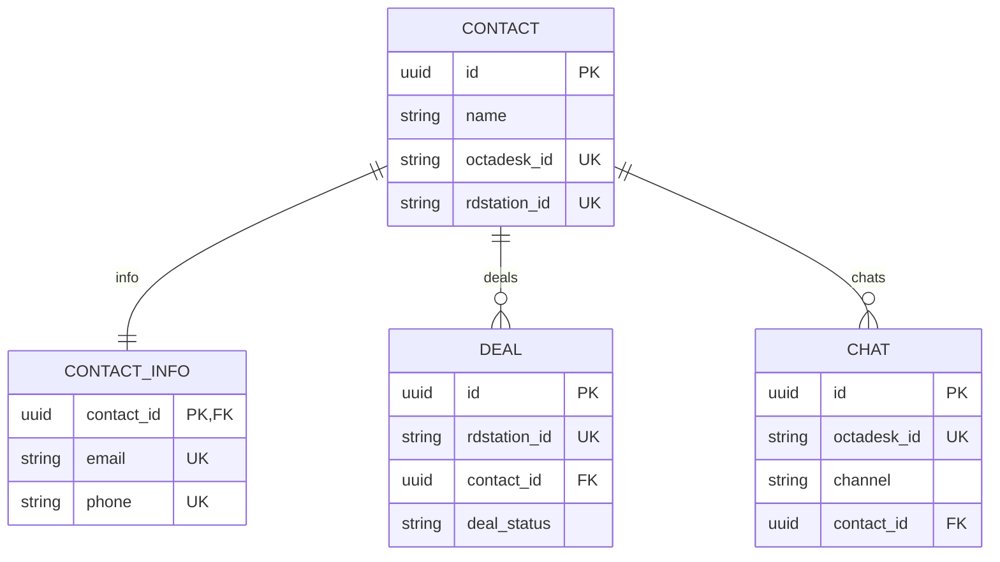

# Database Adapter Documentation

This document details the database persistence architecture, schema models, repository adapters, and connection lifecycle management for the BWT Platform Hub.

---

## 1. Architecture Overview

The persistence layer follows the **Hexagonal Architecture (Ports and Adapters)** pattern:
*   **Domain Ports (`app/src/domain/repositories/`)**: Abstract interfaces (`ContactRepositoryPort`, `DealRepositoryPort`, `ChatRepositoryPort`) defining domain operations without framework/infrastructure dependencies.
*   **Infrastructure Adapters (`app/src/adapters/database/repositories/`)**: Concrete implementations using SQLAlchemy to interact with the PostgreSQL database.
*   **Domain Entities (`app/src/domain/entities/`)**: Pure python domain objects that are decoupled from database tables.



---

## 2. Database Schema

The database consists of four tables representing the core integration entities:



### Table Definitions

#### `contact`
*   `id` (UUID, Primary Key): Unique identifier of the contact (UUIDv4).
*   `name` (VARCHAR(255), Not Null): Full name of the contact.
*   `octadesk_id` (VARCHAR(255), Unique, Nullable): External ID of the contact in Octadesk.
*   `rdstation_id` (VARCHAR(255), Unique, Nullable): External ID of the contact in RD Station.

#### `contact_info`
*   `contact_id` (UUID, Primary Key, Foreign Key referencing `contact.id` with `ON DELETE CASCADE`): Maps one-to-one with `contact`.
*   `email` (VARCHAR(255), Unique, Nullable): Contact email address.
*   `phone` (VARCHAR(255), Unique, Nullable): Contact phone number.

#### `deal`
*   `id` (UUID, Primary Key): Unique identifier of the deal (UUIDv4).
*   `rdstation_id` (VARCHAR(255), Unique, Nullable): External ID of the deal in RD Station.
*   `contact_id` (UUID, Foreign Key referencing `contact.id` with `ON DELETE SET NULL`, Nullable): Associated contact.
*   `deal_status` (VARCHAR(50), Not Null): Current status code of the deal in the pipeline.

#### `chat`
*   `id` (UUID, Primary Key): Unique identifier of the chat (UUIDv4).
*   `octadesk_id` (VARCHAR(255), Unique, Not Null): Room key/conversation ID in Octadesk.
*   `channel` (VARCHAR(50), Not Null): Messaging channel (e.g., `whatsapp`).
*   `contact_id` (UUID, Foreign Key referencing `contact.id` with `ON DELETE SET NULL`, Nullable): Associated contact.

---

## 3. Repository Adapters

Each repository adapter implements the respective Domain Port interface and encapsulates all SQLAlchemy operations:

1.  **`SQLAlchemyContactRepositoryAdapter`**:
    *   Saves contact and contact info details.
    *   Looks up contacts by ID, phone, email, or Octadesk ID.
2.  **`SQLAlchemyDealRepositoryAdapter`**:
    *   Saves deal details.
    *   Looks up deals by ID or RD Station ID.
3.  **`SQLAlchemyChatRepositoryAdapter`**:
    *   Saves chat details.
    *   Looks up chats by ID or Octadesk ID.

---

## 4. Connection & Session Management

Database connections are managed via a transactional session context manager in `app/src/adapters/database/connection.py`:

```python
from contextlib import contextmanager
from typing import Generator
from sqlalchemy.orm import Session
from app.src.adapters.database.connection import get_session

@contextmanager
def get_session() -> Generator[Session, None, None]:
    """Provide a transactional scope around a series of operations."""
    session = SessionLocal()
    try:
        yield session
        session.commit()
    except Exception:
        session.rollback()
        raise
    finally:
        session.close()
```

*   **Commit on Success**: If the block executes without error, the transaction is automatically committed.
*   **Rollback on Exception**: Any database or application exception triggers an automatic rollback of the transaction, preserving data integrity.
*   **Automatic Clean-up**: The session is guaranteed to close, preventing connection leaks.
